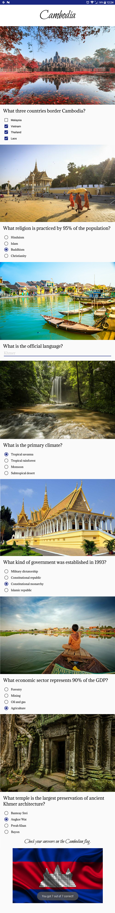

# Cambodia Quiz

This is an Android app that quizzes the user about the country of Cambodia, created as part of the [Android Basics Nanodegree by Google](https://www.udacity.com/course/android-basics-nanodegree-by-google--nd803).

#### 720 x 1280p (API 25) in portrait orientation.

